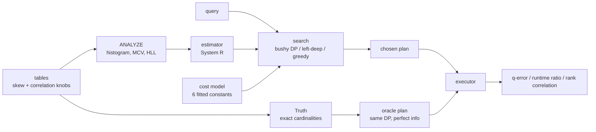

# query-planner

Join ordering, a cost model, and cardinality estimation — with an executor
attached, so every claim is settled by a clock rather than by the cost model
that made it.

[](https://github.com/asp53826/query-planner/actions/workflows/ci.yml)


> The estimates are wrong by up to 76x. It costs nothing. Restricting the search
> to left-deep plans, which is what a lot of real optimizers do, costs 2.15x.

## What is here

- equi-depth histograms, most-common-value lists, and a from-scratch
  HyperLogLog for distinct counts;
- System R selectivity and join cardinality estimation;
- a six-constant cost model fitted against the executor in this repo;
- three searches: bushy DP, left-deep DP, and greedy;
- a vectorised columnar executor, so plans can be run and timed;
- an **oracle**: the same DP run with true cardinalities, which is the plan the
  search would have picked with perfect information.

That last one is what makes the rest measurable. Cardinality estimation and
plan search fail in different ways, and without a perfect-information baseline
they cannot be told apart.

## Measured, not implied

Apple M2 Pro, macOS, CPython 3.13, numpy 2.5. Every table below is produced by a
script in `bench/`.

### 1. How wrong the estimates are

Independence is the assumption that breaks first. Each dimension has a column
`b` that agrees with `a` at a controlled rate; the query filters on both.

| correlation | geomean | median | p95 | max |
|---:|---:|---:|---:|---:|
| 0.00 | 1.19 | 1.04 | 2.18 | 5.0 |
| 0.50 | 1.75 | 1.30 | 5.31 | 25.1 |
| 0.75 | 2.20 | 1.51 | 10.34 | 45.9 |
| 1.00 | **2.49** | 1.66 | **14.74** | **75.9** |

Skew in the join key costs less than expected — geomean 1.02 at Zipf 0.0 rising
only to 1.21 at Zipf 1.2 — because the MCV list absorbs the heavy values before
the histogram ever sees them.

### 2. Where the error compounds, and where it doesn't

| join depth | est rows | actual rows | geomean | p95 | max |
|---:|---:|---:|---:|---:|---:|
| **star schema** (every join hits a primary key) | | | | | |
| 1 | 72,915 | 74,247 | 1.08 | 1.19 | 1.3 |
| 4 | 50,010 | 52,357 | **1.09** | 1.23 | 1.4 |
| **chain of many-to-many joins** | | | | | |
| 1 | 6,058 | 7,836 | 1.29 | 1.34 | 1.4 |
| 2 | 36,584 | 82,616 | 2.27 | 2.53 | 2.7 |
| 3 | 2,891,066 | 51,290,956 | **17.81** | 21.82 | 25.0 |

"Estimation errors compound with join depth" is the standard claim and it is
only half true. In a star schema they essentially do not: every join lands on a
dimension's primary key, so the fact table bounds the result and an error at one
level is not multiplied at the next — 1.08 at depth 1, 1.09 at depth 4.

It is *non-key* joins that compound. Four tables joined on a 100-value column
and the estimate is off by 17.8x, predicting 2.9M rows where the answer is 51M.
Both shapes are in the benchmark because reporting only the second would
overstate the problem and reporting only the first would miss it.

### 3. What the errors actually cost

Runtime relative to the plan the same DP picks with **true** cardinalities.
1.00 means the estimation error cost nothing.

| plan chosen by | uncorrelated | correlated | many-to-many |
|---|---:|---:|---:|
| DP + estimated cardinalities | **1.00** | **0.99** | **1.00** |
| left-deep DP + estimates | **2.15** | **2.10** | 1.07 |
| greedy + estimates | 1.35 | 1.39 | 1.01 |
| *[noise floor: oracle timed against itself]* | *1.00* | *1.00* | *0.99* |
| identical plan to the oracle | 22/25 | 20/25 | 25/25 |
| DP found the global optimum | 25/25 | 25/25 | 25/25 |

**This is the result.** Estimates wrong by up to 76x, and the plans that come
out are indistinguishable from perfect-information plans — the 1.00 sits inside
the noise floor measured by timing the oracle against itself. Even where the
estimator picks a *different* plan (5 of 25 in the correlated case), the plan it
picks is just as fast.

Meanwhile restricting the search to left-deep trees — which plenty of production
optimizers do — costs **2.15x**, twenty times more than every estimation error
in the study combined.

The noise floor row is not decoration. The first run of this study reported a
geomean of 0.87 on a workload where the two plans were identical 6 times out of
6. A plan cannot be 13% faster than itself; that was the clock. Printing the
floor alongside is what stops it reading as a result.

### 4. Does the cost model predict runtime?

Costed with **true** cardinalities, so this isolates the model from the
estimator. Rank correlation, because ordering is all the optimizer uses the
number for.

| | star schema | many-to-many |
|---|---:|---:|
| plans costed and timed | 360 | 75 |
| Spearman rho | **0.772** | **0.773** |
| worst single query | **-0.044** | 0.100 |
| model's pick was the fastest plan | 9/15 | 14/15 |
| model's pick, mean percentile | 12th | 2nd |
| slowdown vs the fastest plan | 1.11x geomean, 1.47x worst | 1.00x |

rho of 0.77 is mediocre, and one query scored **-0.044** — for that query the
model's ranking carried no information at all. It still picked a plan 1.11x off
the best on average, which is the thing that matters and the reason a weak
correlation is survivable: the model only has to get the *top* of the ordering
roughly right.

## Verify it

```bash
python3 -m venv .venv && .venv/bin/pip install -e '.[dev]'
```

```bash
.venv/bin/python -m pytest -q
```

```bash
.venv/bin/python bench/qerror.py
```

```bash
.venv/bin/python bench/optimality.py
```

```bash
.venv/bin/python bench/cost_vs_time.py
```

Raw output for all three is in [`results/`](results).

## The rule that makes it honest

**An estimate may only use what `ANALYZE` could have computed.** Per-column
histograms, an MCV list, an approximate distinct count. No peeking at the data
at estimation time.

Distinct counts come from a HyperLogLog sketch rather than an exact count for
the same reason — the sketch's 1–2% error is one a real system has, and removing
it would flatter every join estimate downstream. `test_statistics_do_not_look_at_the_query`
pins the rule.

## How it fits together



## Where it loses

**The independence assumption is not fixed, on purpose.** Multi-column
statistics would remove the thing being measured.
`test_perfectly_correlated_predicates_are_underestimated` is written so that
implementing them makes it *fail* — that failure is the signal it worked.

**The cost model was fitted against this executor.** rho 0.77 against the thing
it was calibrated on is a ceiling, not a floor. Against a system with a buffer
pool, spilling, or parallelism it would be worse, and there is no I/O term in
the model because there is no I/O.

**No disk, no spilling, no parallelism, no indexes.** Physical operator choice
is hash join versus nested loop and nothing else. Select-project-join only: no
aggregation, no subqueries, no outer joins.

**Four tables is not many.** The oracle executes subplans to get exact
cardinalities, which is why the optimality study is capped there. Real
join-order pathologies start around ten relations, and DP's search effort is
what stops this scaling — that limit is reported in `SearchResult.considered`
rather than hidden.

**`all_plans` is capped and says so.** Above the cap it samples, and the number
dropped is printed. A silent truncation would read as "we costed everything".

**One machine, one clock.** Every runtime here is a single-threaded numpy
process on an M2 Pro. The rank correlations would move on different hardware;
the q-errors would not, which is part of why q-error is the metric the estimation
work is scored on.

## Repository map

```text
qp/data.py         table generation with skew and correlation knobs
qp/stats.py        equi-depth histograms, MCV lists, HyperLogLog
qp/estimate.py     System R selectivity and join cardinality
qp/plan.py         plan nodes and the fitted cost model
qp/enumerate.py    bushy DP, left-deep DP, greedy, exhaustive
qp/execute.py      vectorised executor, and Truth (the oracle)
qp/workload.py     query generation, q-error and its aggregates
bench/qerror.py       estimation error vs correlation, depth, skew
bench/optimality.py   runtime vs the perfect-information plan
bench/cost_vs_time.py cost model vs the clock
```

## What would come next

- sampling-based and learned cardinality estimation, evaluated on this harness;
- multi-column statistics, which should break one test on purpose;
- ten-plus relations, which needs a cheaper oracle than executing subplans;
- an I/O term and a spilling model, which is where a cost model earns its keep;
- pointing the enumerator at `columnar-engine` so the executor is a real one.

## License

MIT.
